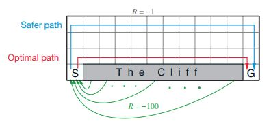
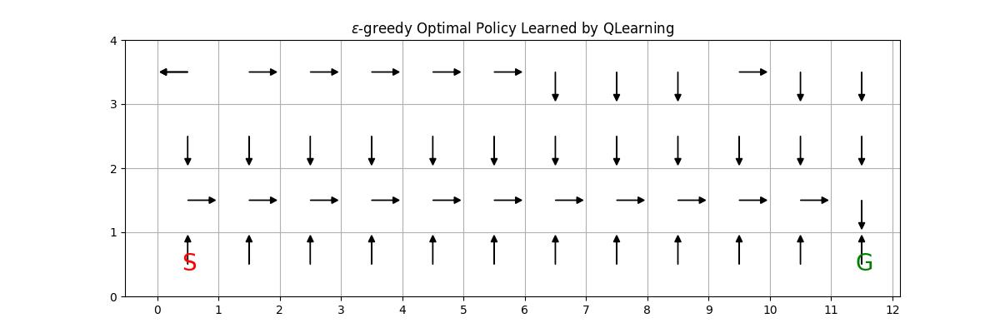
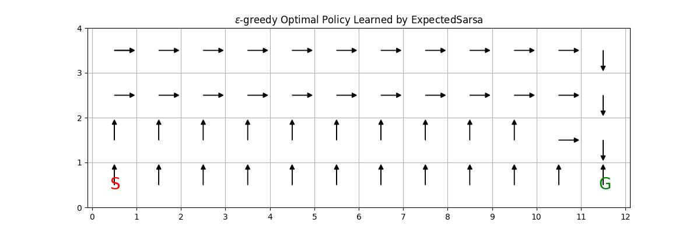

# Reinforcement-Learning-Cliff-Walking

This repo contains python implementation to the cliff walking problem from RL Introduction by Sutton & Barto Example 6.6.  

The purpose is to implement TD(0) policy evaluation and also Q-Learning, Expected Sarsa for policy control.  

## Table of Contents
* [Rules](#rules)
* [RL algorithms](#rl-algorithms)
    * [TD(0)](#td-zero)
    * [Q-Learning](#q-learning)
    * [Expected Sarsa](#expected-sarsa)
* [Setup](#setup)

---
## Rules

  

A standard undiscounted, episodic task, with start and goal states, and the usual actions causing movement up, down,  
right, and left. Reward is 1 on all transitions except those into the region marked “The Cli↵.”  
Stepping into this region incurs a reward of 100 and sends the agent instantly back to the start. 

## RL algorithms
### TD Zero

  

  

### Q Learning

  

### Expected Sarsa

  

